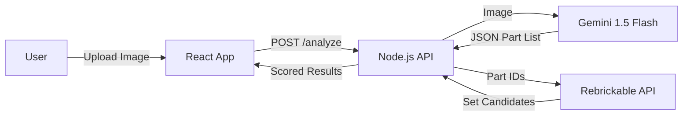

# Master Builder AI

**Project Role**: Senior Full-Stack Architect & Autonomous AI Agent  
**Goal**: Build a mobile-first web app that analyzes LEGO bricks via photo, manages a personal parts library, and suggests builds with high-completion matches.

## Tech Stack
- **Frontend**: React (Vite), Tailwind CSS
- **Backend/Persistence**: Supabase (Auth/DB)

## Architecture

1.  **Frontend**: Vite + React + Tailwind CSS (User Interface to upload images).
2.  **Backend**: Node.js + Express (API to handle logic).
3.  **AI Analysis**: Google Gemini 1.5 Flash (via Backend SDK).
4.  **Lego Data**: Rebrickable API (via Backend Axios calls).
5.  **Database**: Supabase (Optional for user auth/saving history).

## Deployment Strategy
- **Frontend**: Deployed via **Vercel** (connects to GitHub repo).
- **Backend**: Supabase (Cloud).
- **Logic**: Local n8n instance exposed via Cloudflare Tunnel for webhook access.
